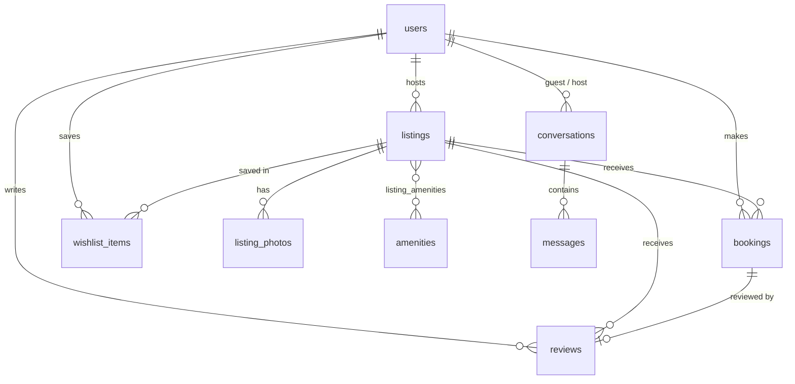

# Airbnb: an Airbnb clone

A full-stack clone of Airbnb's browse → search → book → host workflow.

- **Guests** can:
  - explore a photo-forward grid of homes
  - search by place, dates and guest count, and filter by price, rooms, property type, amenities and Superhost
  - open a listing, pick dates on an availability calendar, see a live price breakdown, and book through a mocked checkout
  - manage trips, wishlists and reviews
- **Hosts** can:
  - create, edit and delete listings (photos by URL or upload)
  - see a dashboard of their listings, reservations and earnings

| Layer    | Tech |
|----------|------|
| Frontend | Next.js 15 (App Router) · TypeScript · Tailwind CSS v4 · lucide-react icons |
| Backend  | Python · FastAPI · SQLAlchemy 2.0 · Pydantic v2 |
| Database | SQLite (schema below, seeded automatically) |
| Tests    | pytest + FastAPI TestClient (booking rules) |

```
.
├── backend/
│   ├── app/
│   │   ├── main.py            # FastAPI app, CORS, static files, startup seeding
│   │   ├── database.py        # engine, session, SQLite FK pragma
│   │   ├── models.py          # ORM models = database schema
│   │   ├── schemas.py         # Pydantic request/response contracts
│   │   ├── serializers.py     # ORM -> response shapes, rating aggregation
│   │   ├── deps.py            # mocked auth (X-User-Id header), host guard
│   │   ├── services/
│   │   │   ├── availability.py  # overlap rules (single source of truth)
│   │   │   └── pricing.py       # nightly × nights + fees + taxes
│   │   ├── routers/           # listings, bookings, host, misc (users, wishlists, uploads)
│   │   └── seed.py            # 52 listings, 15 users, ~400 bookings, ~250 reviews
│   ├── tests/test_api.py
│   └── requirements.txt
└── frontend/
    └── src/
        ├── app/               # routes: /, /listings/[id], /book/[id], /trips, /wishlists, /host, /host/listings/...
        ├── components/        # Header, SearchBar, DateRangeCalendar, ListingCard, FiltersModal, ListingForm, ui
        ├── context/AppProvider.tsx  # current user, wishlist, toasts
        └── lib/               # api client, types, formatting/date helpers, icon maps
```

---

## Running locally

**Prerequisites:** Python 3.11+ and Node 18+.

```bash
# 1) Backend  → http://localhost:8000  (interactive docs at /docs)
cd backend
python -m venv .venv && source .venv/bin/activate      # Windows: .venv\Scripts\activate
pip install -r requirements.txt
uvicorn app.main:app --reload --port 8000
```

On first start the API creates `airbnb.db` and seeds it. To reset the data, run `python -m app.seed --reset`.

```bash
# 2) Frontend → http://localhost:3000
cd frontend
cp .env.example .env.local          # NEXT_PUBLIC_API_URL=http://localhost:8000
npm install
npm run dev
```

```bash
# Tests
cd backend && pip install -r requirements-dev.txt && pytest -q
```

### Demo accounts (mocked auth)

There is no password login. Open the **profile menu → Switch account** to act as any seeded user.

- **Aarav Mehta** is the default guest, with upcoming trips, a past stay already reviewed, a past stay waiting for a review, a trip he cancelled, and a stay and a private-chef dinner that the **host** cancelled (shown as "Cancelled by Host" in Trips). Their inbox has three threads: one with a redacted phone number, a follow-up on the host-cancelled dinner, and a pre-booking inquiry. Switch to **Priya Sharma** to see unread guest messages, including an obfuscated email and a UPI id that were hidden.
- **Priya, Meera and Ananya** are Superhosts. **Rohan and Daniel** are regular hosts. Any host account can use the host dashboard and CRUD.

The active account id is stored in `localStorage` and sent to the API as an `X-User-Id` header. Real auth (JWT or sessions) would only replace `backend/app/deps.py`.

---

## Architecture

```
Next.js (client components)                      FastAPI
┌──────────────────────────┐   fetch + X-User-Id  ┌────────────────────────────────────┐
│ pages → lib/api.ts       │ ───────────────────▶ │ routers (HTTP only)                │
│ AppProvider: user,       │ ◀─────────────────── │   ↓                                │
│   wishlist, toasts       │        JSON          │ services (availability, pricing)   │
│ URL = search/filter state│                      │   ↓                                │
└──────────────────────────┘                      │ SQLAlchemy models → SQLite         │
                                                  └────────────────────────────────────┘
```

- **Thin routers, logic in services.** `availability.py` defines the overlap rule once. Search filtering, the quote endpoint and booking creation all use it, so they can't disagree. `pricing.py` is a pure function used by both the quote endpoint and booking creation, so the price shown always equals the price charged.
- **Server is the source of truth.** The calendar greys out booked dates for UX, but `POST /api/bookings` re-validates everything: date order, past dates, max stay, guest capacity, overlap, and no booking your own listing.
- **Search state lives in the URL** (`/?location=goa&check_in=…&category=Beachfront&amenities=1,4`). Searches are shareable, survive refresh, and work with back/forward.
- **N+1 avoided.** Listing pages use `selectinload`/`joinedload`, and ratings for a whole page are aggregated in one `GROUP BY` query (`serializers.rating_stats`).
- **Pagination:** offset/limit with `total` and `has_more`. The frontend uses infinite scroll (IntersectionObserver), with a "Show more" button as a fallback.

---

## Database schema



| Table | Key columns | Notes |
|---|---|---|
| `users` | id, name, email (unique), avatar_url, bio, is_host, is_superhost, created_at | One table for guests and hosts. A host can also travel as a guest. |
| `listings` | id, **host_id → users**, title, description, property_type, category, city, state, country, latitude, longitude, price_per_night, cleaning_fee, max_guests, bedrooms, beds, bathrooms, created_at | CHECK price > 0 and max_guests > 0. Indexed on host_id, city and category. |
| `listing_photos` | id, **listing_id → listings**, url, position | Ordered gallery; position 0 is the cover. Cascade delete. |
| `amenities` | id, name (unique), icon | Lookup table. |
| `listing_amenities` | **listing_id, amenity_id** (composite PK) | Many-to-many join. |
| `bookings` | id, **listing_id**, **guest_id**, check_in, check_out, guests, nightly_rate, nights, cleaning_fee, service_fee, taxes, total_price, status, created_at | CHECK check_out > check_in. Composite index `(listing_id, check_in, check_out)` for overlap lookups. |
| `reviews` | id, **listing_id**, **author_id**, **booking_id (unique)**, rating, comment, created_at | CHECK rating 1–5. The unique booking_id allows one review per stay. |
| `wishlist_items` | id, **user_id**, **listing_id**, created_at | UNIQUE(user_id, listing_id), so saving twice has no effect. |
| `experiences` | id, **host_id**, kind (experience/service), title, tagline, category, city, meeting_point, lat/lng, price_per_guest, duration_minutes, max_guests, included, … | One table for both tabs. CHECK on kind, price, guests and duration. |
| `experience_photos`, `experience_activities` | **experience_id**, position, … | Ordered gallery and itinerary steps. |
| `experience_slots` | id, **experience_id**, starts_at, capacity | UNIQUE(experience_id, starts_at). Spots left = capacity − confirmed guests. |
| `experience_bookings` | id, **slot_id**, **guest_id**, guests, price snapshot, status, cancelled_by, cancelled_at | Soft cancellation frees the spots. |
| `experience_reviews`, `saved_experiences` | as for listings | One rating per booking; UNIQUE(user_id, experience_id). |
| `conversations` | id, **guest_id**, **host_id**, listing_type (home/experience/service), listing_id, reservation_id (nullable), created_at, updated_at | One thread per guest + listing: UNIQUE(guest_id, host_id, listing_type, listing_id). `listing_id` and `reservation_id` point at different tables depending on `listing_type`, so they're plain integers and the API copes with a deleted listing. A NULL reservation is an inquiry. |
| `messages` | id, **conversation_id**, **sender_id**, sender_role (guest/host), content, raw_attempted_flag, is_blocked, moderation_warning, created_at, read_at | Only the sanitized text is stored. `raw_attempted_flag` means the filter hid something; `is_blocked` means nothing but contact details was sent. `read_at` drives unread badges. |

Design decisions worth calling out:

- **Half-open date ranges** `[check_in, check_out)`. Two stays overlap iff `a.check_in < b.check_out AND b.check_in < a.check_out`. A guest can check in on the same day the previous guest checks out, as on Airbnb.
- **Price snapshot on each booking.** The nightly rate, fees, taxes and total are copied onto the booking row, so a host changing their price later doesn't rewrite past or upcoming bookings.
- **Soft cancellation** (`status = 'cancelled'`, plus `cancelled_by = 'guest' | 'host'` and `cancelled_at` on both booking tables). The server decides `cancelled_by` from who is calling, never from the request body, so a guest can't label their own cancellation as the host's. Older databases get these columns through a small `ALTER TABLE` migration on startup (`app/seed.py: migrate`). History is kept, and availability queries only consider `confirmed` bookings, so cancelling frees the dates immediately.
- **Ratings are derived, not stored.** Averages and counts come from `reviews` with an aggregate query, so they can never drift out of sync.
- **Foreign keys are enforced in SQLite.** SQLite ignores FKs by default, so `PRAGMA foreign_keys=ON` is set on every connection (`database.py`).
- **Messages go through a Trust & Safety filter** (`app/services/moderation.py`) so bookings and payments stay on the platform. Text is normalized first: NFKC folds fullwidth `０-９`, zero-width characters are removed, and every Unicode digit is mapped to ASCII. Obvious contact details (plain digits, an email address, a link) get `422 {"code": "CONTACT_INFO_PROHIBITED"}`; the composer already blocks these as you type. Obfuscated attempts are replaced with `[Hidden by Airbnb for safety]`, and both sides see an amber notice in the thread. These include `9 . 8 . 7`, "nine eight seven", "double nine", Hinglish "ek do teen", "name at gmail dot com", UPI ids, @handles, and WhatsApp/Telegram/Instagram/"call me". A lone number word ("this one", "two beds") is ordinary language; three in a row, or a "double"/"triple", counts as a number.
- **Deleting a listing is blocked while it has upcoming reservations** (409). The host has to cancel those first, so guests never lose a trip silently.

---

## API overview

Interactive docs are available at `GET /docs` (Swagger).

| Method | Endpoint | Description |
|---|---|---|
| GET | `/api/listings` | Search. Query params: `location, check_in, check_out, guests, category, property_types, amenities, min_price, max_price, bedrooms, beds, bathrooms, superhost, sort, page, page_size` |
| GET | `/api/listings/price-stats` | Min/max price and histogram for the price filter |
| GET | `/api/listings/{id}` | Detail: all photos, amenities, host stats, booked date ranges |
| GET | `/api/listings/{id}/quote` | Price breakdown and availability for `check_in, check_out, guests` |
| GET / POST | `/api/listings/{id}/reviews` | List reviews / review a **completed** stay |
| POST | `/api/listings` | Create a listing (host) |
| PUT / DELETE | `/api/listings/{id}` | Update / delete your own listing (host) |
| POST | `/api/bookings` | Create a booking. Returns 409 if the dates overlap an existing booking. |
| GET | `/api/bookings/me` | My trips |
| POST / PATCH | `/api/bookings/{id}/cancel` | Cancel (guest or the listing's host); records `cancelled_by` |
| GET | `/api/host/listings` | Host's listings with upcoming count and earnings |
| GET | `/api/host/bookings` | Reservations on the host's listings |
| GET | `/api/host/experiences?kind=` | Host's experiences/services with upcoming bookings, open slots and earnings |
| GET | `/api/host/experiences/{id}` | Edit-form data, including daily start times taken from future slots |
| GET | `/api/host/experience-bookings` | Bookings on the host's experiences and services |
| PATCH | `/api/host/reservations/{home\|experience\|service}/{id}/cancel` | Host-initiated cancellation (`cancelled_by = 'host'`) |
| POST / PUT / DELETE | `/api/experiences`, `/api/experiences/{id}` | Create, edit or delete an experience or service. Start times generate slots; a booked slot is never removed. DELETE returns 409 while bookings are upcoming. |
| GET / PUT / DELETE | `/api/wishlists`, `/api/wishlists/ids`, `/api/wishlists/{listing_id}` | Wishlist (PUT is idempotent) |
| GET | `/api/users`, `/api/amenities`, `/api/categories`, `/api/property-types` | Lookups |
| POST | `/api/uploads` | Image upload (image/*, max 5 MB). Returns a URL. |
| GET | `/api/experiences` | Search experiences or services. Query params: `kind (experience\|service), location, category, date_from, date_to, guests, sort, page, page_size` |
| GET | `/api/experiences/categories?kind=&all=` | Categories that have at least one item (`all=true` for every option) |
| GET | `/api/experiences/{id}`, `/slots`, `/quote`, `/reviews` | Detail, upcoming slots with spots left, price for `guests`, ratings |
| POST | `/api/experiences/{id}/reviews` | Rate a booking once its slot has ended |
| POST | `/api/experience-bookings` | Book `slot_id` for `guests`. Returns 409 if the slot doesn't have enough spots. |
| GET / POST, PATCH | `/api/experience-bookings/me`, `/api/experience-bookings/{id}/cancel` | My experience bookings / cancel |
| GET / PUT / DELETE | `/api/experiences/saved`, `/api/experiences/saved/ids`, `/api/experiences/{id}/save` | Saved experiences (PUT is idempotent) |
| GET | `/api/conversations?role=guest\|host` | Inbox: counterpart, listing, reservation status, last message, unread count |
| POST | `/api/conversations` | Get-or-create a thread from `listing_type` + `listing_id` (a guest's inquiry) or `reservation_id` (guest or host, from a trip or reservation) |
| GET | `/api/conversations/{id}` | Thread with messages and the reservation/listing context |
| POST | `/api/conversations/{id}/messages` | Send. Runs `sanitize_and_validate_message`: 422 `CONTACT_INFO_PROHIBITED` or a redacted message with `moderation_warning` |
| POST | `/api/conversations/{id}/read` | Mark the other side's messages read |
| GET | `/api/conversations/unread-count` | Header badge |

Errors are JSON `{"detail": "..."}` with meaningful status codes:
- 401: no user
- 403: not a host / not the owner
- 404: not found
- 409: dates taken, or listing has upcoming bookings
- 422: validation. A Trust & Safety block also carries `{"code": "CONTACT_INFO_PROHIBITED", "message": "..."}`

---

## Features checklist

- **Home & search:**
  - Listing grid with a photo carousel, rating and "Guest favourite" badge
  - Where / Check in / Check out / Who search with suggested destinations and a two-month calendar
  - Category icon row
  - Filters modal: sort, price histogram with slider, rooms and beds, property type, amenities, Superhost, and a live "Show N places" count
  - Infinite scroll
- **Listing detail:**
  - 5-photo grid and a "Show all photos" modal
  - Highlights, expandable description, amenities with a "Show all" modal
  - Availability calendar with booked nights disabled
  - Sticky reservation card with a server-computed price breakdown
  - Reviews with a rating distribution
  - OpenStreetMap location map and a "Meet your host" card
- **Booking:**
  - Date and guest validation on both client and server
  - "Confirm and pay" page (mocked payment) and confirmation screen
  - My Trips: All / Upcoming / Past / Cancelled tabs; cancel a trip; leave a review after a completed stay. Host cancellations get a "Cancelled by Host" badge, a refund banner, a muted photo and an alert at the top of the page
- **Host:**
  - Dashboard with stats
  - Listings table with edit and delete
  - Tabs for Your Listings, Your Experiences, Your Services and Reservations. Reservations cover all three types, with a type badge and filter chips, and hosts can cancel them
  - "Create listing" asks whether you're adding a Home, an Experience or a Service; experiences and services can be edited and deleted
  - Create/edit form with property type, category, location, counts, amenities, photos (URL or upload) and pricing
- **Airbnb feel:**
  - Rausch (#FF385C) palette with the gradient CTA
  - Header tabs: All (a mix of homes, experiences and services), Homes, Experiences, Services
  - Pill search bar that collapses to a compact pill on scroll
  - Modals, toasts, wishlist hearts with optimistic updates
  - Responsive layout: mobile search modal and a bottom reserve bar
- **Experiences & services:**
  - Tabs with "Happening today / Tomorrow / This weekend" rows (time badges), category rows and chips, and a single-day "When" search that stays in the tab
  - Detail page: photo grid, highlights, "What you'll do" itinerary (or "What's offered" for services), ratings, meeting-point map, host and "More in <city>"
  - Sticky "Show dates" card with real time slots and spots left; booking modal with a server-computed price; capacity re-checked on the server (409 when full)
  - Bookings and cancellations in Trips, ratings after the slot ends, and hearts saved to Wishlists
- **Messaging:**
  - `/messages` (everything) and `/host/messages` (hosting only). Three panes: conversations with search and All / Unread / Homes / Experiences / Services filters; the thread; and a reservation drawer with dates, guests, total and a status badge (Upcoming, Cancelled by Host, Cancelled by Guest, Inquiry, …)
  - "Message host" on every home, experience and service page and on every trip card, including host-cancelled ones; "Message guest" on each host reservation
  - The composer checks as you type: digits, emails and links disable Send with a 🛡️ warning, and obfuscated contact details are flagged before they're hidden
  - Unread badge on the account menu; the inbox refreshes every few seconds
  - Seeded threads include a spelled-out phone number, an obfuscated email, a UPI id and a WhatsApp nudge, all redacted
- **Placeholders:** account settings, real payments.

## Assumptions

- **Currency is INR.** Service fee is 14% of the nightly subtotal. Taxes are 12% of (subtotal + cleaning + service fee). Both are configurable in `services/pricing.py`.
- **Dates are calendar dates** without time zones. Check-in is assumed to be in the afternoon and check-out in the morning.
- **Branding:** the app is branded "Airbnb" with an original logo. It copies Airbnb's UI patterns, not its trademarks.
- **Seed photos** are Unsplash URLs. If one fails to load, the UI falls back to a placeholder image.
- **Concurrency:** SQLite allows one writer at a time, which is enough to serialise booking inserts at this scale. On Postgres I'd add an exclusion constraint on `(listing_id, daterange(check_in, check_out))`, or lock the listing row with `SELECT … FOR UPDATE` before checking availability.

## Deployment

- **Backend (Render):**
  1. New → Web Service → this repo, root directory `backend`.
  2. Build command: `pip install -r requirements.txt`
  3. Start command: `uvicorn app.main:app --host 0.0.0.0 --port $PORT --proxy-headers --forwarded-allow-ips='*'` (so uploaded image URLs are `https://`)
  4. Set `TZ=Asia/Kolkata`: experience times and "today" use server-local time, and Render defaults to UTC.
  5. Optionally set `CORS_ORIGINS=https://<your-vercel-app>.vercel.app`.

  `render.yaml` contains the same settings as a blueprint. The free tier's disk is ephemeral: whenever the service restarts, redeploys or wakes from sleep, the SQLite file is recreated and re-seeded. New bookings, listings, messages and uploads are lost at that point. For data that persists, attach a Render persistent disk (paid plans) and set `DATABASE_URL=sqlite:////var/data/airbnb.db`.
- **Frontend (Vercel):**
  1. Import the repo with root directory `frontend`.
  2. Set the environment variable `NEXT_PUBLIC_API_URL=https://<your-render-service>.onrender.com`.
  3. Deploy.
